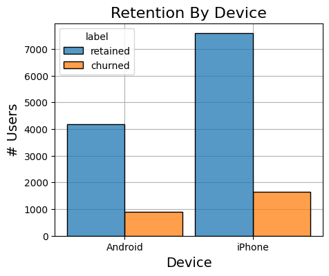
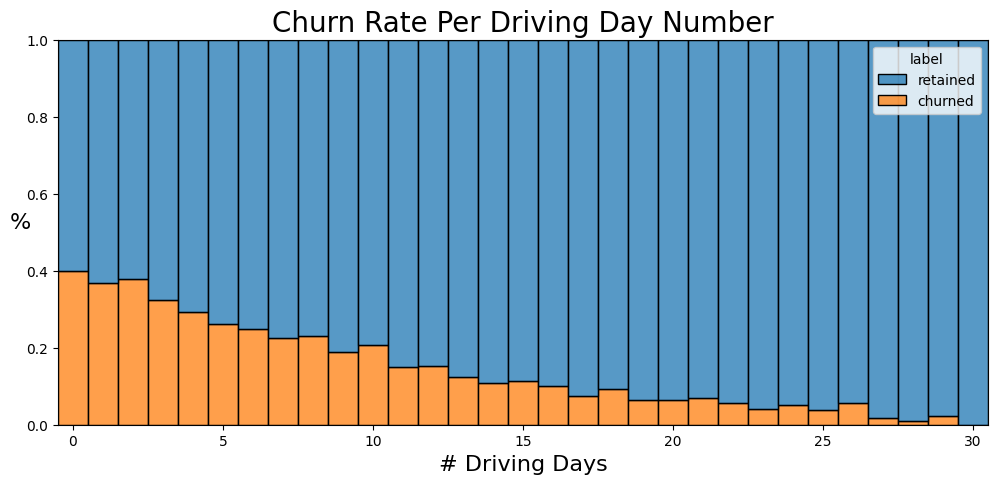
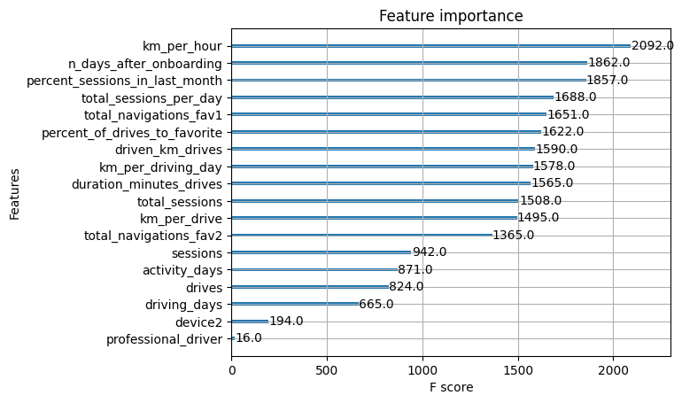

# Predicting User Churn for a Navigation App

## Project Overview

This project focuses on predicting user churn for a navigation app using statistical analysis, regression models and machine learning algorithms. The primary goal is to enhance user retention by identifying the key behaviors and characteristics of users who are more likely to stop using the app. We leveraged a dataset with user activity data, built predictive models and provided insights to inform marketing and product strategies. 

## Business Understanding

### Stakeholders
The key stakeholders for this project are product and marketing teams for the app, who are interested in identifying at-risk users to improve user retention, customer satisfaction and growth.

### Business Problem
User churn, defined as users uninstalling the app or ceasing its use, directly impacts growth and revenue. Our analysis aims to understand the factors contributing to churn and to develop models that predict churned users. This information will guide strategies for targeted engagement and retention initiatives, ultimately improving the customer lifetime value.

## Data Understanding

### Dataset
- **Source**: User activity data.
- **Timeframe**: Data includes user activities and engagement metrics for the final month of activity.
- **Variables**: The dataset contains 12 unique variables, including total driving distance, app access frequency and user device type (iPhone vs. Android). Approximately 18% of users in the dataset have churned, while 82% are retained.

### Key Insights from Exploratory Data Analysis (EDA)
- **Churned Users**: Churned users tend to drive longer distances per day, despite using the app less frequently compared to retained users.
- **Retention Correlations**: Users who opened the app more often showed lower churn rates, while higher daily driving distances were positively correlated with churn.
- **Device Type Analysis**: A two-sample hypothesis test indicated no statistically significant difference in driving behaviors between iPhone and Android users.
- **Data Limitations**: Missing values were present in the label column and skewed distributions in several variables required careful handling during data preprocessing.

## Modeling and Evaluation

### Regression Analysis
- **Objective**: Predict user churn using a binomial logistic regression model.
- **Results**: The model achieved a moderate precision of 53%, but its recall was low at 9%, indicating difficulty in correctly identifying all churned users.
- **Top Predictors**: The number of activity days (negative correlation with churn) and driving distance were key variables.

### Machine Learning Models
- **Models Used**: Random Forest and XGBoost models.
- **Results**: The XGBoost model outperformed the Random Forest model, achieving a recall score of 18% while maintaining precision. This performance nearly doubled the recall compared to the logistic regression model.
- **Top Predictors**: Engineered features such as the percentage of sessions in the last month, speed and total sessions per day emerged as significant factors in predicting user churn.

### Evaluation Metrics
- **Precision**: Focused on minimizing false positives to avoid unnecessary retention efforts.
- **Recall**: Emphasized identifying at-risk users to maximize intervention opportunities.
- **Model Comparison**: While the tree-based models provided better accuracy and recall, the logistic regression model offered easier interpretability.

## Conclusion

### Recommendations
- **Targeted Engagement**: Focus on users with high daily driving distances but lower app access frequency for targeted retention efforts.
- **Feature Development**: Enhance app features that encourage frequent access to improve user engagement and retention.
- **Device-specific Strategies**: Although no significant differences were found between device types, continuing to monitor device-specific behaviors may reveal new insights as user trends evolve.

### Future Steps
- **Data Collection**: Gather more granular data on individual drives, such as driving times and locations.
- **Refinement of Features**: Explore additional user interaction data like reporting road hazards and tracking unique starting/ending points.
- **Model Iteration**: Iterate on the models with more detailed data to improve predictive performance and accuracy.
